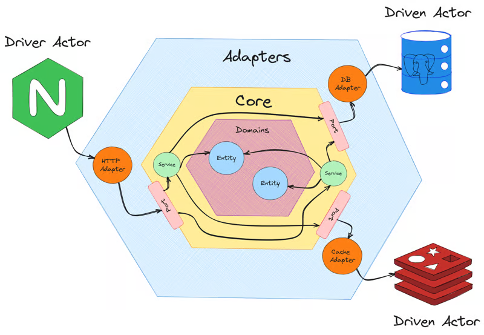
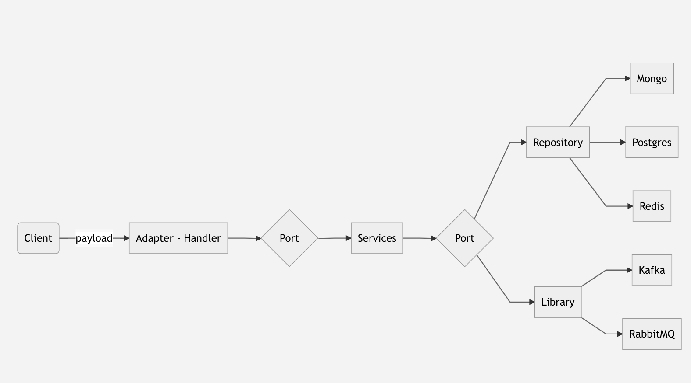
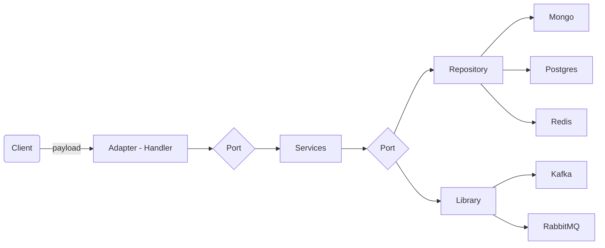

# Introduction
Application for massive logging user activities

## How to
Majoo repository **svc-activity** currently has several commands, to run those application simply run these commands below.
- Consumer/Listener (Kafka Broker)
```  
go run main.go consumer  
```  
- List item
```  
go run main.go http  
```  

## Create new commands

To create a new commands for application such as

- Cron / Scheduler
- Socket server
- gRPC
- Streaming
- Web RTC
- Etc.

Go to Folder named **cmd**

1. Add new file for new command such as **socket.go**
2. Register command that you created to **cmd.go**

## Folder Structure
This repository is using hexagonal architecture pattern, hexagonal architecture has an **flexibility** to adapt a new port or even changing port with minimum changes
1. `cmd`: List of registered commands or entrypoints
2. `config`: List of configurations and dependencies
3. `utils`: List of **GLOBAL** helper functions
4. `docs`: Stored documentations (add more docs in markdown format if necessary) and swagger
5. `internal`: Source folder
    1. `adapter`: List of external stacks of application (databases, cache, brokers, etc)
        1. `handler`
        2. `libraries`
        3. `repository`
    2. `core`: List of business logic here
        1. `domain`: List of struct input and output for port
            1. `presenters`: Request and response from handler
            2. `entities`: Input and output from service
            3. `models`: Input and output from repository
        2. `port`: These are a list of adapter interfaces to obey for interacting between services and adapter and for **Unit Test** mock purposes
            1. `handler`
            2. `libraries`
            3. `repository`
        3. `services`: These are a list of business logic


## Structure Preview
This preview is **ONLY**  example, between `adapter` and `core` required port for flexibility:




preview using: https://mermaid.js.org/intro/


## Swagger

This repository is using swagger for http documentation
|No|Link|
|--|--|
| echo swagger | https://github.com/swaggo/echo-swagger/tree/master |
| go swag |.https://github.com/swaggo/swag#declarative-comments-format |

> Install first swag command on go swag

How to add new documentation on handler
1. Add new declarative comment on handler
2. on root folder run this `swag init -g cmd/http.go`
3. Format comments `swag fm`
4. Those commands will update file on `docs/docs.go` `docs/swagger.json` `docs/swagger.yaml`
5. Run http application `go run main.go http`
6. Go to `base-url/docs/`, now see the update